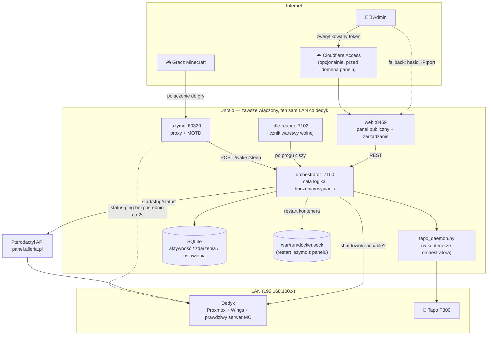
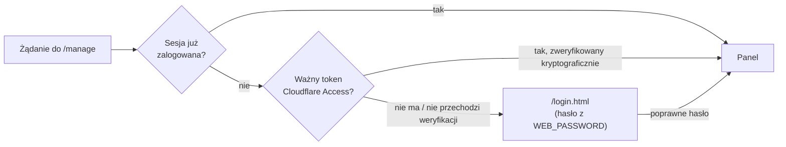
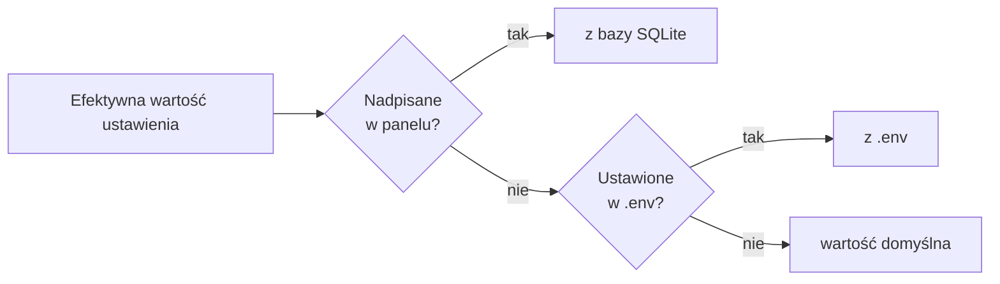
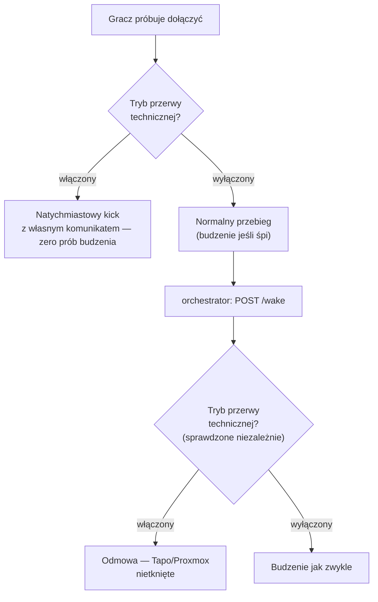
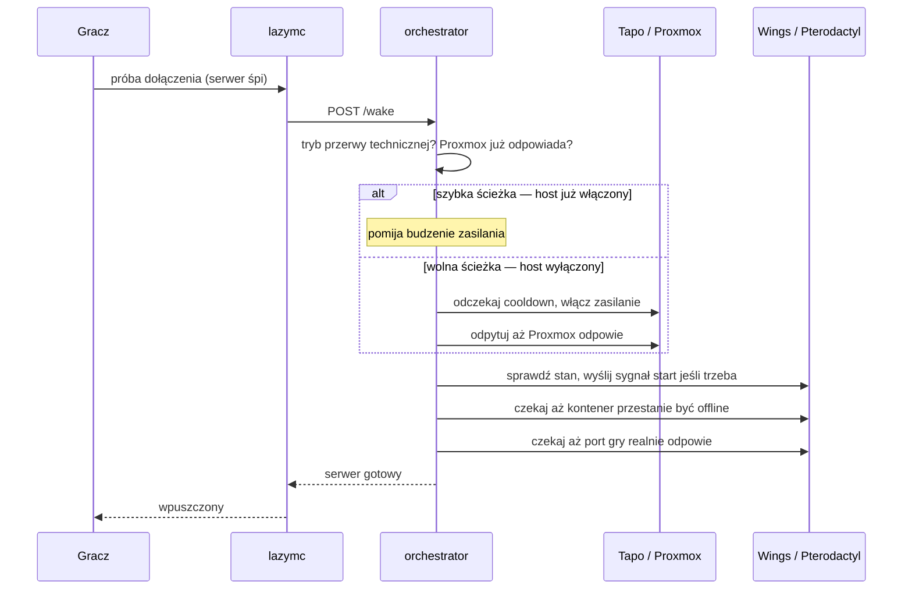
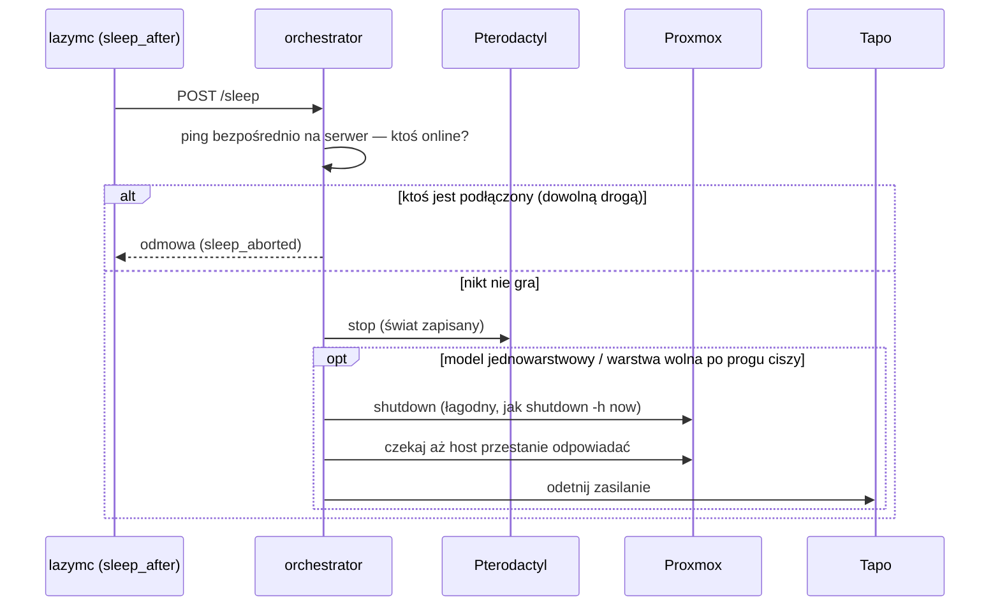

# mcwake

Automatyczne budzenie i usypianie całego fizycznego serwera Minecraft
(dedyk z Proxmoksem + Pterodactyl/Wings) — gracze łączą się cały czas pod
tym samym adresem, a fizyczna maszyna stoi wyłączona między sesjami zamiast
palić prąd 24/7 dla kilkugodzinnej rozgrywki raz na jakiś czas.

Gdy ktoś dołącza, a serwer śpi: dostaje komunikat "serwer się budzi"
zamiast odmowy połączenia, a w tle system budzi fizyczną maszynę, czeka aż
wstanie Proxmox, każe Pterodactylowi odpalić kontener Minecrafta, i
przepuszcza gracza automatycznie gdy tylko serwer faktycznie odpowiada. Gdy
nikt nie gra przez dłuższy czas — system sam usypia kontener, a po
dłuższej ciszy wyłącza cały komputer. Całość steruje się z panelu
webowego, bez wchodzenia na serwer po SSH.

## Spis treści

- [Jak to działa (skrót)](#jak-to-działa-skrót)
- [Architektura](#architektura)
- [Panel webowy](#panel-webowy)
- [Konfiguracja z panelu (nadpisania `.env`)](#konfiguracja-z-panelu-nadpisania-env)
- [Tryb przerwy technicznej](#tryb-przerwy-technicznej)
- [Bezpieczeństwo i odporność na błędy](#bezpieczeństwo-i-odporność-na-błędy)
- [Technologie](#technologie)
- [Jak to działa — krok po kroku](#jak-to-działa--krok-po-kroku)
- [Konfiguracja zewnętrznych systemów](#konfiguracja-zewnętrznych-systemów)
- [Instalacja](#instalacja)
- [Monitoring zewnętrzny](#monitoring-zewnętrzny-uptime-kuma-i-podobne)
- [Duże modpacki (Forge) i status-ping](#duże-modpacki-forge-i-status-ping)
- [Tapo / TPAP — dlaczego Python](#tapo--tpap--dlaczego-python)
- [Znane ograniczenia i możliwe rozszerzenia](#znane-ograniczenia-i-możliwe-rozszerzenia)
- [Status implementacji](#status-implementacji)
- [Struktura repo](#struktura-repo)
- [Testowanie / rozwój](#testowanie--rozwój)

## Jak to działa (skrót)

Dwa modele bezczynności do wyboru jednym przełącznikiem w panelu
(`SLEEP_TRIGGERS_FULL_SHUTDOWN`):

- **Dwuwarstwowy** (domyślny) — krótkie przerwy w graniu nie kosztują
  długiego czekania, długie realnie oszczędzają prąd:
  1. **Warstwa szybka (`lazymc`)** — gdy ostatni gracz wyjdzie, usypiany
     jest tylko kontener Minecraft w Pterodactylu. Fizyczny komputer
     zostaje włączony, więc powrót tego samego dnia to restart kontenera
     — sekundy, nie minuty.
  2. **Warstwa wolna (`idle-reaper`)** — dopiero po realnej ciszy (domyślnie
     7 dni) system wyłącza cały fizyczny serwer przez Proxmox.
- **Jednowarstwowy** — sam próg `lazymc` (ustawiony na docelową wartość,
  np. ~7 dni) od razu wyłącza cały host zamiast tylko usypiać kontener;
  `idle-reaper` staje się wtedy zbędny.

Budzenie fizycznej maszyny idzie przez **wtyczkę TP-Link Tapo** sterowaną
programowo (Wake-on-LAN był pierwotnym planem, ale sprzęt sieciowy nigdy
nie doczekał się wsparcia WoL w Linuksie — [szczegóły niżej](#tapo--tpap--dlaczego-python)).

Wszystkim steruje się z **panelu webowego**: start/stop/pełne wyłączenie,
**tryb przerwy technicznej** (blokuje przypadkowe budzenie np. podczas
prac serwisowych), edycja większości ustawień bez dotykania `.env`, statystyki
czasu uruchamiania/zamykania, logi, health-check każdego komponentu.

## Architektura



- **lazymc** — jedyna rzecz widoczna dla graczy: proxy Minecrafta z
  customowym MOTD. Gdy ktoś dołącza do śpiącego serwera, uruchamia
  `bridge/wake.sh` (skonfigurowane jako `server.command`), które woła
  orchestrator przez HTTP i trzyma połączenie aż lazymc każe mu się
  zatrzymać. Niezależnie od tego pinguje prawdziwy serwer bezpośrednio co
  2s, żeby wykryć że już działa.
- **orchestrator** — cała logika: szybka vs. wolna ścieżka budzenia, Tapo,
  Proxmox API, Pterodactyl API, SQLite (aktywność, zdarzenia, ustawienia,
  statystyki faz), health-checki pozostałych komponentów, restart lazymc
  przez Docker Engine API.
- **idle-reaper** — niezależny, wolny licznik pilnujący progu warstwy
  wolnej; własny mini-serwer HTTP (`/health`) do monitoringu.
- **web** — panel: publiczny status (`/`, bez logowania) + zarządzanie za
  hasłem lub przez Cloudflare Access (`/manage`) + `/healthz*` dla
  zewnętrznego monitoringu.
- **tapo_daemon.py** — długo żyjący proces obok orchestratora w tym samym
  kontenerze, trzymający jedną sesję do listwy Tapo zamiast robić kosztowny
  handshake przy każdej akcji.

## Panel webowy

### `/` — status publiczny, bez logowania

- **Komponenty** — kafelek dla każdego elementu systemu (panel, orchestrator,
  baza, lazymc, idle-reaper, Proxmox, Pterodactyl, sam serwer MC) + czas
  od ostatniej aktywności.
- **Statystyki uruchamiania/zamykania** — ostatnie 20 uruchomień i 20
  zamknięć, rozbite na fazy z dokładnym czasem trwania każdej (kolorowy
  pasek proporcji + dokładny czas mm:ss), licznik cooldownu Tapo na żywo.
- Baner trybu przerwy technicznej, jeśli aktywny.

### `/manage` — zarządzanie (hasło albo Cloudflare Access)



- **Zarządzanie** — start, uśpienie samego kontenera, pełne wyłączenie
  maszyny (z potwierdzeniem), przełącznik **trybu przerwy technicznej**.
- **Gracze** — ostatnio widziani, obok Zarządzania w tym samym rzędzie.
- **Polityka bezczynności** — aktualne progi obu warstw, jednym spojrzeniem.
- **Komponenty** — jak na stronie publicznej, plus czas bezczynności.
- **Konfiguracja** — edycja większości ustawień bez `.env`, patrz
  [sekcja niżej](#konfiguracja-z-panelu-nadpisania-env).
- **Statystyki uruchamiania/zamykania** — jak na stronie publicznej.
- **Zdarzenia** — pełna historia (wake/sleep/shutdown/restart/tryb
  serwisowy — wszystko ze znacznikiem czasu).
- **Logi** — orchestrator, idle-reaper, Tapo (osobno, obok siebie).

## Konfiguracja z panelu (nadpisania `.env`)

Większość ustawień można zmienić z karty **Konfiguracja** zamiast edytować
`.env` i restartować kontenery ręcznie. Nadpisanie trzymane jest w SQLite i
ma pierwszeństwo przed `.env` — usunięcie nadpisania (przycisk "↺
domyślne") wraca do wartości z `.env`/domyślnej.



| Grupa | Ustawienia |
|---|---|
| Publiczny MOTD | wersja i protokół MC pokazywane na liście serwerów zanim ktoś się połączy |
| Zachowanie lazymc | próg usypiania kontenera (selektor dni/godz/min zamiast surowych sekund), czy serwer to Forge |
| Wiadomości MOTD | wszystkie komunikaty: śpi / budzi się / usypia / kick przy budzeniu / kick przy usypianiu / komunikat trybu przerwy technicznej |
| Zasilanie | strategia budzenia (Tapo / WoL, dropdown), cooldown gniazdka Tapo w sekundach |
| Model bezczynności | przełącznik jedno- / dwuwarstwowy |
| Idle-reaper | włączony/wyłączony, próg ciszy, częstotliwość sprawdzania |

Pola wpływające na `lazymc` (MOTD, próg usypiania, Forge) są oznaczone
„wymaga restartu: lazymc” — zaczynają obowiązywać po restarcie kontenera,
który panel robi jednym kliknięciem (patrz niżej). Reszta (strategia
zasilania, model bezczynności, ustawienia idle-reapera) działa od razu, bez
restartu — te usługi odczytują efektywną wartość na bieżąco, nie tylko raz
przy starcie.

**Restart lazymc z panelu** — orchestrator ma zamontowany
`/var/run/docker.sock` i restartuje kontener `lazymc` przez Docker Engine
API (bez `docker` CLI, bezpośrednio po HTTP do socketu), więc zmiana ustawień
wymagających restartu to jedno kliknięcie zamiast wchodzenia na serwer.
To realne uprawnienie nad całym hostem Dockera, nie tylko nad tym stackiem
— jeśli wolisz tego nie mieć, wystarczy usunąć wpis z `volumes:` przy
`orchestrator` w `docker-compose.yml` i restartować `lazymc` ręcznie
(`docker compose restart lazymc`).

## Tryb przerwy technicznej

Przełącznik w karcie **Zarządzanie** — zabezpieczenie na wypadek prac
serwisowych (np. aktualizacja na fizycznym serwerze), żeby gracz nie mógł
przypadkowo obudzić maszyny w trakcie.



Dwie niezależne warstwy zabezpieczenia, żeby żadna pojedyncza nie musiała
być idealna:

1. **lazymc `[lockout]`** — każde dołączenie odrzucane natychmiast, zanim
   dojdzie do jakiejkolwiek logiki budzenia/usypiania.
2. **Twarda blokada w orchestratorze** — `POST /wake` odmawia wykonania,
   niezależnie od tego co je wywołało (lazymc czy panel), zanim dotknie
   Tapo/Proxmoksa.

Przełączenie automatycznie restartuje `lazymc`, żeby nowy komunikat od razu
zaczął obowiązywać — rozłącza aktualnie połączonych graczy, dlatego panel
pyta o potwierdzenie.

## Bezpieczeństwo i odporność na błędy

- **Sprawdzenie graczy bezpośrednio na serwerze przed uśpieniem/wyłączeniem.**
  `lazymc` widzi tylko graczy którzy połączyli się przez jego proxy — jeśli
  istnieje dowolna inna droga do prawdziwego serwera (np. bezpośrednie
  połączenie zapasowe), orchestrator i tak sprawdza żywy stan wprost na
  serwerze (status-ping) tuż przed każdym usypianiem/wyłączeniem —
  automatycznym i ręcznym z panelu. Jeśli ktokolwiek jest online, operacja
  jest odrzucana i zapisywana jako zdarzenie `sleep_aborted`.
- **Awaria Unraida nie może "zablokować" serwera w złym stanie.** Zarówno
  budzenie jak i usypianie idą przez orchestrator — jeśli host go hostujący
  nie działa, żadna z tych akcji się nie wykona (nie tylko budzenie).
  Ewentualne pomylenie stanu po stronie `lazymc` (błędnie pokaże "śpi")
  samo się koryguje przy najbliższym udanym pingu, gdy host wróci.
- **Cloudflare Access weryfikowany kryptograficznie**, nie po samej
  obecności nagłówka — token jest sprawdzany przeciw kluczom publicznym
  Cloudflare dla konkretnej aplikacji (`aud`), więc nie da się go podrobić
  wchodząc bezpośrednio po IP:port.
- **Statyczne assety panelu z `Cache-Control: no-store`** — bez tego
  Cloudflare potrafi cache'ować JS/CSS na brzegu sieci i serwować starą
  wersję po deployu, mimo świeżego kodu na serwerze.
- **Cięcie prądu na Tapo dopiero po potwierdzeniu, że Proxmox faktycznie
  przestał odpowiadać** (nie od razu po wysłaniu komendy shutdown) — cięcie
  w trakcie zamykania mogłoby uszkodzić system plików.

## Technologie

| Warstwa | Co i po co |
|---|---|
| Proxy Minecrafta | [lazymc](https://github.com/timvisee/lazymc) (Rust) — MOTD dla śpiącego serwera, wykrywanie że już działa, kick z komunikatem, `[lockout]` dla trybu przerwy technicznej. Kompilowany ze źródeł z jednym patchem (patrz niżej). |
| Backend | Node.js 20 + TypeScript, [Express](https://expressjs.com/) — orchestrator i panel webowy. |
| Baza danych | [SQLite](https://sqlite.org/) przez [better-sqlite3](https://github.com/WiseLibs/better-sqlite3) — last-seen, log zdarzeń, statystyki faz, nadpisania ustawień z panelu. Jeden plik, współdzielony wolumen Dockera. |
| Kontrola zasilania | [python-kasa](https://github.com/python-kasa/python-kasa) (fork z obsługą TPAP, patrz niżej) — sterowanie gniazdem listwy Tapo P300 przez lokalne API. |
| Restart kontenerów z panelu | Docker Engine API bezpośrednio przez zamontowany `/var/run/docker.sock` — bez `docker` CLI w obrazie. |
| Autoryzacja panelu | [`jose`](https://github.com/panva/jose) — weryfikacja podpisanych tokenów Cloudflare Access (JWKS), plus klasyczne hasło (`express-session`) jako fallback. |
| Kontenery | Docker + Docker Compose — cztery usługi (`lazymc`, `orchestrator`, `idle-reaper`, `web`), wieloetapowe Dockerfile'e. |
| Panel webowy | Zwykły HTML + CSS + vanilla JS (bez frameworka). |
| Zewnętrzne API | Pterodactyl Client API (stan i sterowanie serwerem MC), Proxmox VE API (stan i wyłączanie hosta). |
| Monitoring | `/healthz` i `/healthz/:komponent` — proste endpointy HTTP zgodne z [Uptime Kuma](https://github.com/louislam/uptime-kuma). |

## Jak to działa — krok po kroku

### Budzenie (gracz dołącza do śpiącego serwera)



1. **Zlecenie** — zapisywane jako zdarzenie `wake_requested`, zaczyna się
   nowa sesja statystyk.
2. **Faza "zlecenie → zasilanie"** (tylko wolna ścieżka) — cooldown Tapo,
   włączenie gniazdka (albo magic packet WoL).
3. **Faza "boot hosta"** — odpytywanie Proxmox API aż odpowie
   (`HOST_BOOT_TIMEOUT_SECONDS`, domyślnie 10 min).
4. **Faza "start Wings/kontenera"** — czekanie aż Pterodactyl przestanie
   zgłaszać `offline`.
5. **Faza "start Minecrafta"** — odpytywanie bezpośrednio portu gry aż
   odpowie — to realny czas bootowania Minecrafta/Forge.
6. Zdarzenie `mc_ready` kończy sesję statystyk.

### Usypianie i wyłączanie



- **Warstwa szybka** — ostatni gracz wychodzi → po
  `LAZYMC_SLEEP_AFTER_SECONDS` lazymc wysyła SIGTERM do `bridge/wake.sh` →
  `POST /sleep` → orchestrator zatrzymuje tylko kontener MC. Fizyczny host
  zostaje włączony.
- **Warstwa wolna** — idle-reaper co `IDLE_REAPER_POLL_INTERVAL_MINUTES`
  sprawdza czas od ostatniej aktywności; po przekroczeniu
  `IDLE_REAPER_THRESHOLD_MINUTES` woła `POST /admin/shutdown-host` (to samo
  wywołuje przycisk "Wyłącz cały serwer" w panelu).

## Konfiguracja zewnętrznych systemów

Cały setup idzie przez `.env` (skopiuj z `.env.example`, każda zmienna ma
tam komentarz) — większość da się później zmieniać z panelu (patrz
[wyżej](#konfiguracja-z-panelu-nadpisania-env)). Poniżej rzeczy, które
trzeba zrobić *poza* tym repo.

### Pterodactyl

1. **Client API key** (nie Application API!) — zaloguj się jako zwykły
   user, kliknij avatar w prawym górnym rogu → **API Credentials** →
   **Create New**. Bez wybierania żadnych uprawnień.
   → `PTERODACTYL_API_KEY`
2. **Server ID** — krótki 8-znakowy identifier z paska adresu:
   `https://panel.example.com/server/XXXXXXXX`. Nie pełny UUID, nie
   numeryczny ID z bazy.
   → `PTERODACTYL_SERVER_ID`
3. `PTERODACTYL_URL` — adres panelu.

### Proxmox

1. **API Token**: Datacenter → Permissions → API Tokens → Add. **Odznacz
   "Privilege Separation"**, żeby token odziedziczył pełne prawa usera
   (inaczej trzeba osobno nadać `Sys.PowerMgmt` — bez tego shutdown hosta
   zwróci 403).
   → `PROXMOX_TOKEN_ID`, `PROXMOX_TOKEN_SECRET`
2. `PROXMOX_HOST` — adres Proxmoksa (`https://<ip>:8006`).
3. `PROXMOX_NODE` — nazwa node'a widoczna w lewym panelu pod "Datacenter".
4. `PROXMOX_ALLOW_SELF_SIGNED=true`, jeśli Proxmox używa własnego certu.

### Budzenie fizycznej maszyny — Tapo albo WoL

`POWER_ON_STRATEGY=tapo` albo `wol` (edytowalne też z panelu — Konfiguracja
→ Zasilanie).

**Tapo** (zalecane jeśli sprzęt sieciowy nie wspiera WoL):
- `TAPO_EMAIL` / `TAPO_PASSWORD` — dane logowania do konta Tapo.
- `TAPO_DEVICE_IP` — IP samego urządzenia w LAN, **nie huba** Tapo.
- Listwa z wieloma gniazdami: `TAPO_CHILD_POSITION` (numer portu,
  zalecane) albo `TAPO_CHILD_NAME` (dokładny alias gniazda).
- `TAPO_POWER_OFF_COOLDOWN_SECONDS` — minimalny czas wyłączenia zanim
  orchestrator z powrotem włączy gniazdko (edytowalne z panelu, licznik na
  żywo widać przy Statystykach).

**WoL** — wymaga karty sieciowej ze wsparciem Wake-on-LAN w Linuksie
(`ethtool <interfejs>`, szukaj `Wake-on:`) i "Power On by PCI-E" w BIOS:
- `WOL_MAC_ADDRESS` — adres MAC karty sieciowej dedyka.
- `WOL_TARGET_ADDRESS` — adres broadcast Twojej sieci LAN, **nie** zwykłe
  IP dedyka (dedyk jest wyłączony, unicast nie zadziała).

### Cloudflare Access (opcjonalnie — auto-login do panelu)

Jeśli domena panelu jest już za Cloudflare Access, można pominąć hasło dla
ruchu który przez ten Access przeszedł — weryfikowane kryptograficznie, więc
dostęp bezpośrednio po IP:port (LAN/Tailscale) nadal poprawnie wymaga hasła:

- `CF_ACCESS_TEAM_DOMAIN` — Zero Trust → Settings, postać
  `<zespół>.cloudflareaccess.com`.
- `CF_ACCESS_AUD` — Zero Trust → Access → Applications → (ta aplikacja) →
  Overview → "Application Audience (AUD) Tag".

Zostaw oba puste, żeby całkiem wyłączyć tę ścieżkę (samo hasło jak dotychczas).

### Sieć

- Unraid (albo cokolwiek hostuje `docker compose`) i dedyk muszą mieć
  wspólną sieć — dziś to zwykły LAN, bez VPN-a.
- Port-forward na routerze domowym: `WAN:PUBLIC_PORT` →
  `LAN-IP-Unraida:PUBLIC_PORT` — tak łączą się gracze z zewnątrz.
- Panel webowy (`WEB_PORT`) nie musi być wystawiony na zewnątrz — domyślnie
  dostępny tylko w LAN, co jest wystarczające.

## Instalacja

```bash
cp .env.example .env
# uzupełnij .env — patrz sekcja wyżej

docker compose up -d --build
docker compose logs -f
```

Panel: `http://<lan-ip-unraida>:<WEB_PORT>`. Publiczny status na `/`, hasło
do zarządzania w `WEB_PASSWORD` (albo auto-login przez Cloudflare Access,
jeśli skonfigurowany).

## Monitoring zewnętrzny (Uptime Kuma i podobne)

Panel wystawia proste, niewymagające logowania endpointy HTTP:

| Endpoint | Sprawdza |
|---|---|
| `GET /healthz` | wszystko naraz — 200 tylko jeśli każdy komponent jest zdrowy, inaczej 503 |
| `GET /healthz/web` | sam panel |
| `GET /healthz/orchestrator` | orchestrator |
| `GET /healthz/database` | SQLite |
| `GET /healthz/lazymc` | proxy (port nasłuchuje) |
| `GET /healthz/idle-reaper` | licznik warstwy wolnej |
| `GET /healthz/proxmox` | API Proxmoksa odpowiada |
| `GET /healthz/pterodactyl` | API Pterodactyl odpowiada |
| `GET /healthz/mc-server` | sam serwer Minecraft odpowiada na status-ping |

Każdy zwraca `200` gdy zdrowe, `503` gdy nie.

## Duże modpacki (Forge) i status-ping

lazymc odpytuje prawdziwy serwer bezpośrednio (status-ping) co 2 sekundy,
żeby wykryć że już działa. Dwa realne problemy wyszły na to podczas testów
z dużym modpackiem (ATM9, ~300 modów):

1. **Ikonka serwera (`server-icon.png`) ma limit 32 KB na całą odpowiedź
   status-ping.** Nieoptymalizowana ikonka 64×64 w base64 potrafi to
   przebić. Napraw: podmień ją na dobrze skompresowany PNG (paleta 256
   kolorów lub mniej) — przez Pterodactyl Client API (`files/write`).
   **Wymaga restartu serwera MC** — ikonka wczytywana jest raz przy starcie.
2. **Forge dorzuca listę modów (`forgeData`) do status-ping** w formacie
   którego biblioteka protokołu używana przez lazymc nie parsuje (błąd
   `invalid type: map, expected a string`) — nie kwestia rozmiaru, sam
   kształt JSON-a. Czasem `description`/MOTD jest obiektem
   chat-component zamiast zwykłego stringa, ten sam sztywny parser to też
   odrzuca.

   Patch w `lazymc/patches/monitor.rs`, nakładany w Dockerfile po
   `git clone` przed kompilacją: gdy ścisły dekoder zawiedzie, patch ręcznie
   wyciąga surowy JSON, usuwa `forgeData`/`modinfo`, spłaszcza obiektowe
   `description` do stringa, próbuje jeszcze raz. lazymc i tak nie używa
   tych danych, więc ich wycięcie nic nie psuje.

## Tapo / TPAP — dlaczego Python

Krótka historia, bo wpływa na kod: pierwotny plan zakładał zwykły
Wake-on-LAN. Karta sieciowa dedyka (Qualcomm Atheros Killer E2400,
sterownik `alx`) **nigdy nie doczekała się wsparcia WoL w Linuksie** —
funkcja została usunięta z jądra w 2013 przez buga i nigdy oficjalnie nie
wróciła (istnieje nieoficjalny patch DKMS, `docs/alx-wol-instrukcja.md` ma
notatki na wypadek powrotu do tego tematu — świadomie odłożone na bok jako
zbyt ryzykowne dla produkcyjnego hypervisora).

Zamiennik: wtyczka/listwa **TP-Link Tapo**, sterowana programowo. Tu
pojawił się drugi problem: firmware 1.4.x tych urządzeń przeszedł na nowy
protokół lokalnego API — **TPAP** (handshake SPAKE2+/ECDSA) zamiast
starszego KLAP. **Żadna biblioteka JavaScript/TypeScript go nie obsługuje**
— stąd Python: [python-kasa](https://github.com/python-kasa/python-kasa)
ma to w nieukończonym, nieoficjalnym PR
([python-kasa/python-kasa#1592](https://github.com/python-kasa/python-kasa/pull/1592)),
z którego korzysta `services/common/tapo/` (fork z jednym dodatkowym
fixem, przypięty do konkretnego commita).

Handshake SPAKE2+ jest zauważalnie cięższy obliczeniowo niż zwykłe
hashowanie — dla skromnego mikrokontrolera w P300 robienie go od nowa przy
każdej pojedynczej akcji potrafiło zapchać urządzenie tak, że przestawało
odpowiadać na discovery. Dlatego `services/common/tapo/tapo_daemon.py` to
**długo żyjący proces** trzymający jedną sesję przez całą dobę zamiast
łączyć się od zera za każdym razem — `tapo.ts` w Node.js gada z nim przez
lokalne HTTP (`127.0.0.1:7101`). Każde połączenie/akcja jest logowane
(`/data/logs/tapo.log`, widoczne w panelu w karcie Logi).

## Znane ograniczenia i możliwe rozszerzenia

- **lazymc jest pojedynczym punktem awarii dla łączności graczy.** Cały
  ruch graczy idzie przez `lazymc` na Unraidzie — jeśli Unraid padnie albo
  jest restartowany, nikt się nie połączy, nawet jeśli prawdziwy serwer MC
  na dedyku dalej działa. Rozważana poprawka: przenieść tylko `lazymc`
  (i ewentualnie `web`) na osobny, zawsze-włączony VPS, połączony z
  Tailscale do reszty stacku — Tapo/Proxmox zostają na Unraidzie (to
  sterowanie fizycznym sprzętem w LAN, nie da się stąd wyjąć bez tunelu z
  powrotem). Orchestrator/idle-reaper zostają tam gdzie są.
- **DNS SRV nie daje realnego failoveru** — klienci Minecrafta w praktyce
  nie próbują kolejnych rekordów `SRV` przy nieudanym połączeniu
  ([znany bug Mojanga](https://bugs.mojang.com/browse/MC-151920)), więc
  drugi rekord jako "backup" nic by nie dał.
- Synchronizacja `banned-ips.json` z Wings (obecnie `block_banned_ips=false`).
- Per-fazowy (dynamiczny) komunikat MOTD dla szybkiej vs. wolnej ścieżki
  budzenia — na razie jeden komunikat.

## Status implementacji

- ✅ Tapo (TPAP, przez daemon Pythona, z logowaniem) + Wake-on-LAN jako
  alternatywna strategia
- ✅ Pterodactyl (status + power start/stop), Proxmox (reachability +
  shutdown)
- ✅ Jedno- i dwuwarstwowa logika bezczynności, przełączalna z panelu
- ✅ Panel webowy: publiczny status bez logowania, zarządzanie za hasłem
  lub Cloudflare Access, konfiguracja bez `.env`, tryb przerwy technicznej,
  restart lazymc jednym kliknięciem
- ✅ Sprawdzenie graczy bezpośrednio na serwerze przed każdym
  usypianiem/wyłączeniem (niezależne od tego, jak się połączyli)
- ✅ Health-checki komponentów + `/healthz*` dla Uptime Kuma
- ✅ Patch lazymc na duże modpacki Forge (limit ikonki, format `forgeData`,
  `description` jako chat-component)
- ⬜ Synchronizacja `banned-ips.json` z Wings
- ⬜ Per-fazowy komunikat MOTD dla szybkiej vs. wolnej ścieżki budzenia
- ⬜ `lazymc`/`web` na osobnym VPS (odporność na awarię Unraida)

## Struktura repo

```
lazymc/                          # obraz Docker z lazymc + config template + bridge script + patch
  patches/monitor.rs              # patch na duże modpacki Forge
  bridge/wake.sh                  # server.command — most do orchestratora
  lazymc.toml.template            # generowany przy starcie z efektywnych ustawień

services/common/                 # współdzielony kod TypeScript
  src/db.ts                       # SQLite: aktywność, gracze, zdarzenia/sesje, ustawienia panelu
  src/settings.ts                 # katalog ustawień panelu + rozwiązywanie panel/.env/domyślne
  src/clients/                    # Pterodactyl, Proxmox, WoL, Tapo, Docker Engine API, status MC
  tapo/                            # daemon Pythona (python-kasa fork) + requirements.txt

services/orchestrator/           # HTTP API: /wake /sleep /admin/* /config/* /status /components /stats /logs
  src/wake.ts                     # ścieżka budzenia (szybka/wolna), fazy statystyk
  src/sleep.ts                     # tier 1 — usypianie kontenera MC + sprawdzenie graczy bezpośrednio
  src/hostShutdown.ts              # tier 2 — pełne wyłączenie hosta
  src/stats.ts                     # liczenie faz z sesji zdarzeń
  src/components.ts                # health-checki innych usług

services/idle-reaper/            # niezależny proces pilnujący progu bezczynności + własny /health

services/web/                    # panel webowy
  src/cfAccess.ts                  # weryfikacja tokenów Cloudflare Access
  public/                          # statyczne assety, strona publiczna (/)
  views/manage.html                # panel zarządzania
```

## Testowanie / rozwój

Docker jest dostępny lokalnie tylko do budowania obrazów
(`docker compose build`) i typecheckingu (`npm run typecheck`) — nie do
faktycznego uruchamiania stacku, bo cała logika (Tapo, Proxmox,
Pterodactyl) wymaga prawdziwej sieci domowej. Właściwe testy robimy na
docelowym serwerze przez SSH.
