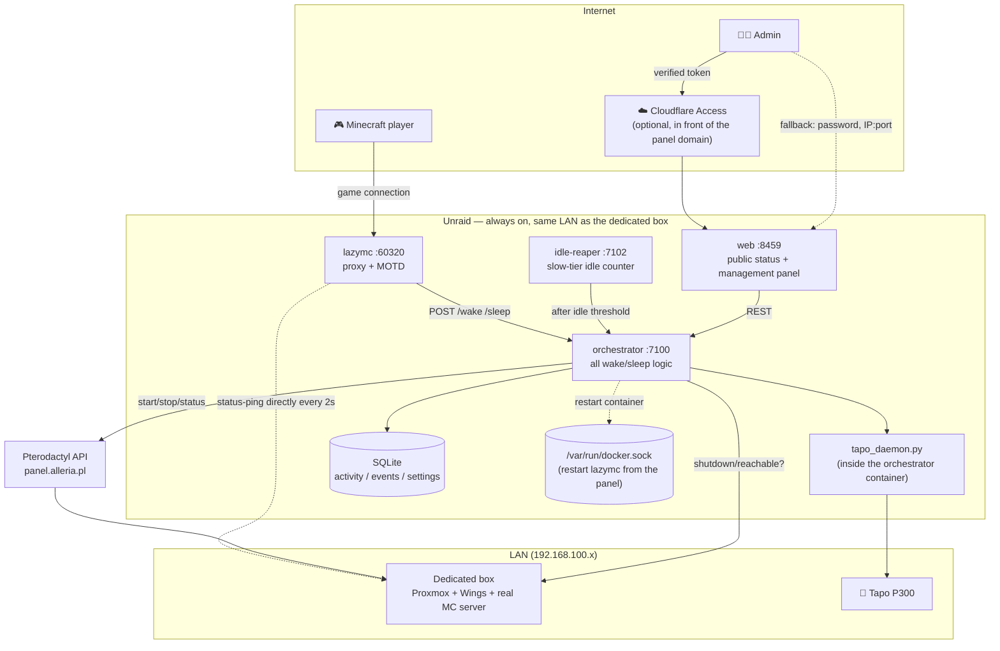
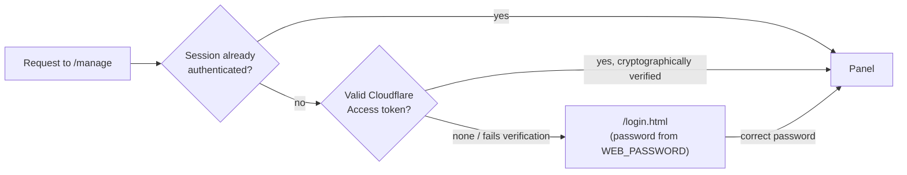
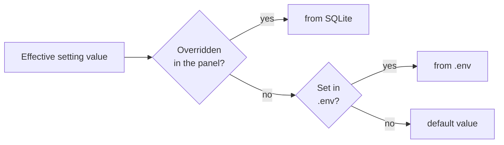
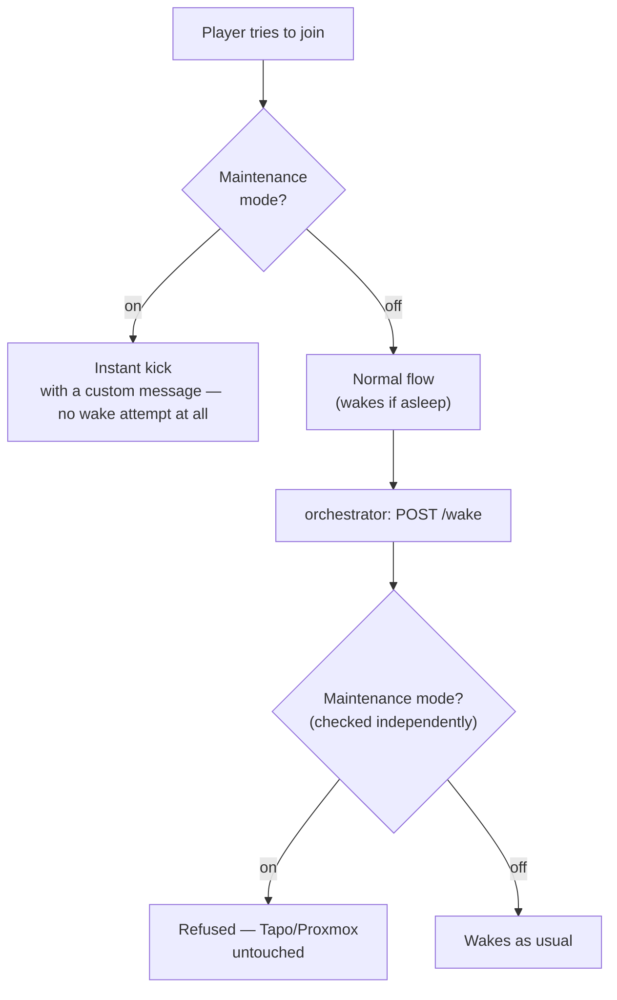
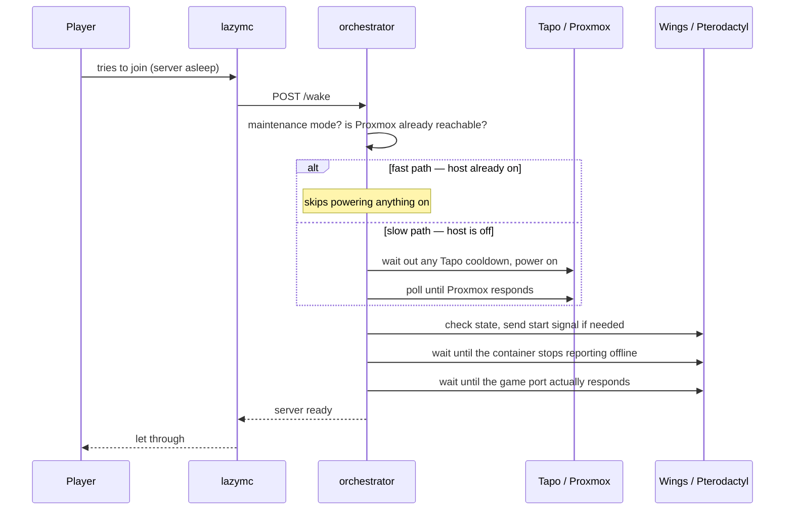
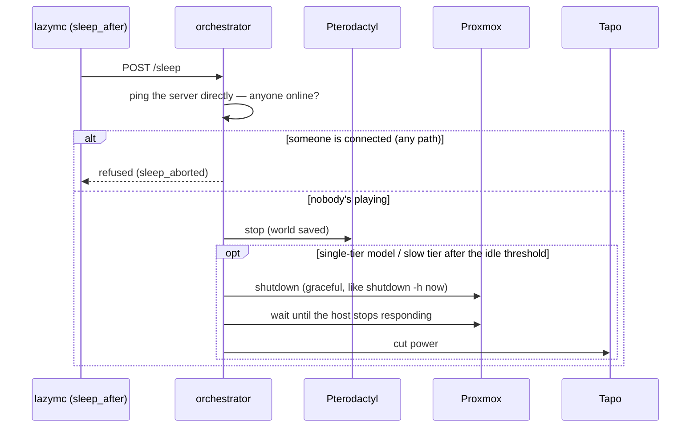

# mcwake

Automatic wake/sleep for an entire physical Minecraft server (a bare-metal
box running Proxmox + Pterodactyl/Wings) — players connect at the same
address at all times, while the physical machine stays powered off between
sessions instead of burning electricity 24/7 for a few hours of play every
now and then.

When someone joins while the server is asleep: they get a "server is
waking up" message instead of a connection refusal, while in the
background the system powers on the physical machine, waits for Proxmox to
come up, tells Pterodactyl to start the Minecraft container, and lets the
player through automatically as soon as the server actually responds. When
nobody plays for a while, the system sleeps the container on its own, and
after a longer silence shuts down the whole computer. Everything is
controlled from a web panel, no SSH required.

## Table of contents

- [How it works (short version)](#how-it-works-short-version)
- [Architecture](#architecture)
- [Web panel](#web-panel)
- [Panel configuration (`.env` overrides)](#panel-configuration-env-overrides)
- [Maintenance mode](#maintenance-mode)
- [Safety and fault tolerance](#safety-and-fault-tolerance)
- [Tech stack](#tech-stack)
- [How it works — step by step](#how-it-works--step-by-step)
- [External system configuration](#external-system-configuration)
- [Installation](#installation)
- [External monitoring](#external-monitoring-uptime-kuma-and-similar)
- [Large modpacks (Forge) and status-ping](#large-modpacks-forge-and-status-ping)
- [Tapo / TPAP — why Python](#tapo--tpap--why-python)
- [Known limitations and possible extensions](#known-limitations-and-possible-extensions)
- [Implementation status](#implementation-status)
- [Repo structure](#repo-structure)
- [Testing / development](#testing--development)

## How it works (short version)

Two idle models, switchable with one toggle in the panel
(`SLEEP_TRIGGERS_FULL_SHUTDOWN`):

- **Two-tier** (default) — short breaks in playing don't cost a long wait,
  long ones genuinely save power:
  1. **Fast tier (`lazymc`)** — once the last player leaves, only the
     Minecraft container in Pterodactyl gets put to sleep. The physical
     machine stays on, so coming back the same day just means a container
     restart — seconds, not minutes.
  2. **Slow tier (`idle-reaper`)** — only after real, sustained silence
     (7 days by default) does the system shut down the whole physical
     server through Proxmox.
- **Single-tier** — `lazymc`'s own threshold (set to your real target, e.g.
  ~7 days) shuts down the whole host directly instead of just sleeping the
  container. Keep `idle-reaper` **enabled** even here, with a matching
  threshold — `lazymc`'s own timer lives only in that process's memory and
  resets to zero on any restart of the `lazymc` container (a redeploy, a
  crash, a host reboot — not just a deliberate one), silently keeping the
  machine on far longer than intended. `idle-reaper` reads a persistent,
  SQLite-backed last-activity timestamp instead, so it survives `lazymc`
  restarts and acts as the real backstop.

Waking the physical machine goes through a **TP-Link Tapo smart plug**
controlled in software (Wake-on-LAN was the original plan, but the network
hardware never got WoL support on Linux — [details below](#tapo--tpap--why-python)).

Everything is controlled from the **web panel**: start/stop/full shutdown,
**maintenance mode** (blocks accidental wake-ups, e.g. during servicing),
editing most settings without touching `.env`, wake/shutdown timing
statistics, logs, health checks for every component.

## Architecture



- **lazymc** — the only thing players ever see: a Minecraft proxy with a
  custom MOTD. When someone joins a sleeping server, it runs
  `bridge/wake.sh` (configured as `server.command`), which calls the
  orchestrator over HTTP and stays alive until lazymc tells it to stop.
  Independently, it also pings the real server directly every 2s to detect
  that it's already up.
- **orchestrator** — all the logic: fast vs. slow wake path, Tapo, Proxmox
  API, Pterodactyl API, SQLite (activity, events, settings, phase-timing
  stats), health checks for the other components, restarting lazymc
  through the Docker Engine API.
- **idle-reaper** — an independent, slow-tier watchdog for the idle
  threshold; its own small HTTP server (`/health`) for monitoring.
- **web** — the panel: public status (`/`, no login) + management behind a
  password or Cloudflare Access (`/manage`) + `/healthz*` for external
  monitoring.
- **tapo_daemon.py** — a long-lived process alongside the orchestrator in
  the same container, holding one session to the Tapo strip instead of
  doing an expensive handshake on every single action.

## Web panel

### `/` — public status, no login

- **Components** — a tile for every part of the system (panel,
  orchestrator, database, lazymc, idle-reaper, Proxmox, Pterodactyl, the
  MC server itself) + time since last activity.
- **Wake/shutdown stats** — the last 20 wake-ups and 20 shutdowns, broken
  into phases with the exact duration of each (a proportional color bar +
  exact mm:ss text), a live Tapo cooldown countdown.
- A maintenance-mode banner, if active.

### `/manage` — management (password or Cloudflare Access)



- **Management** — start, sleep just the container, full machine shutdown
  (with confirmation), a **maintenance mode** switch.
- **Players** — last seen, sitting next to Management in the same row.
- **Idle policy** — current thresholds for both tiers, at a glance.
- **Components** — same as the public page, plus idle time.
- **Configuration** — editing most settings without `.env`, see
  [the section below](#panel-configuration-env-overrides).
- **Wake/shutdown stats** — same as the public page.
- **Events** — full history (wake/sleep/shutdown/restart/maintenance mode
  — all timestamped).
- **Logs** — orchestrator, idle-reaper, Tapo (separate, side by side).

## Panel configuration (`.env` overrides)

Most settings can be changed from the **Configuration** card instead of
editing `.env` and restarting containers by hand. An override is stored in
SQLite and takes precedence over `.env` — clearing it (the "↺ default"
button) reverts to the `.env`/default value.



| Group | Settings |
|---|---|
| Public MOTD | MC version and protocol shown on the server list before anyone connects |
| lazymc behavior | container sleep threshold (a day/hour/minute picker instead of raw seconds), whether the server is Forge |
| MOTD messages | every message: sleeping / waking / stopping / kick-while-waking / kick-while-stopping / maintenance-mode message |
| Power | wake strategy (Tapo / WoL, dropdown), Tapo plug cooldown in seconds |
| Idle model | single-tier / two-tier switch |
| Idle-reaper | enabled/disabled, idle threshold, poll interval |

Fields that affect `lazymc` (MOTD, sleep threshold, Forge) are marked
"requires restart: lazymc" — they take effect once the container restarts,
which the panel does in one click (see below). Everything else (power
strategy, idle model, idle-reaper settings) applies immediately, no restart
— those services read the effective value live, not just once at startup.

**Restarting lazymc from the panel** — the orchestrator has
`/var/run/docker.sock` mounted and restarts the `lazymc` container through
the Docker Engine API (no `docker` CLI, straight HTTP to the socket), so
applying a restart-requiring setting is one click instead of SSH-ing into
the server. That's real control over the whole Docker host, not just this
stack — if you'd rather not grant that, just remove the entry from
`volumes:` under `orchestrator` in `docker-compose.yml` and restart
`lazymc` manually (`docker compose restart lazymc`).

## Maintenance mode

A switch in the **Management** card — a safeguard for servicing (e.g.
updating something on the physical machine) so a player can't accidentally
wake it up mid-maintenance.



Two independent layers of protection, so no single one has to be perfect:

1. **lazymc `[lockout]`** — every join is rejected instantly, before any
   sleep/wake logic even runs.
2. **A hard block in the orchestrator** — `POST /wake` refuses to execute,
   regardless of what called it (lazymc or the panel), before it ever
   touches Tapo/Proxmox.

Toggling it automatically restarts `lazymc` so the new message takes
effect immediately — that disconnects currently-connected players, which
is why the panel asks for confirmation first.

## Safety and fault tolerance

- **The idle counter doesn't depend only on lazymc.** `lazymc` only sees
  players who connect through its own proxy — if there's any other path to
  the real server (e.g. a direct backup connection), the idle counter on
  its own would be blind to that activity. That's why an independent
  poller (`activity.ts`) pings the real server **directly** every 30s, with
  lazymc entirely out of the picture, and refreshes the global
  last-activity marker whenever anyone is online — no matter how they
  connected. That's the same marker `idle-reaper` compares against the
  shutdown threshold.
- **An extra check right before execution.** On top of the above, the
  orchestrator pings the server directly once more, right before every
  actual sleep/shutdown (automatic or manual from the panel) — if anyone
  happens to be online at that moment, the operation is refused and logged
  as a `sleep_aborted` event.
- **An Unraid outage can't leave the server "stuck" in a bad state.** Both
  waking and sleeping go through the orchestrator — if the host running it
  is down, neither action can execute (not just waking). Any resulting
  state confusion on lazymc's side (it might briefly show "sleeping"
  incorrectly) self-corrects the moment the host is back and the next
  status poll succeeds.
- **Cloudflare Access is verified cryptographically**, not by the mere
  presence of a header — the token is checked against Cloudflare's public
  keys for this specific application (`aud`), so it can't be forged by
  hitting the panel directly over IP:port.
- **Static panel assets are served with `Cache-Control: no-store`** —
  without that, Cloudflare can cache JS/CSS at the edge and keep serving a
  stale version after a deploy, even with fresh code on the server.
- **Tapo power is only cut after confirming Proxmox actually stopped
  responding** (not right after sending the shutdown command) — cutting
  power mid-shutdown could corrupt the filesystem.

## Tech stack

| Layer | What and why |
|---|---|
| Minecraft proxy | [lazymc](https://github.com/timvisee/lazymc) (Rust) — MOTD for a sleeping server, detecting it's already up, kick-with-message, `[lockout]` for maintenance mode. Compiled from source with one patch (see below). |
| Backend | Node.js 20 + TypeScript, [Express](https://expressjs.com/) — the orchestrator and the web panel. |
| Database | [SQLite](https://sqlite.org/) via [better-sqlite3](https://github.com/WiseLibs/better-sqlite3) — last-seen, event log, phase-timing stats, panel setting overrides. One file, a shared Docker volume. |
| Power control | [python-kasa](https://github.com/python-kasa/python-kasa) (a fork with TPAP support, see below) — controlling the Tapo P300 strip's socket over its local API. |
| Restarting containers from the panel | The Docker Engine API directly over a mounted `/var/run/docker.sock` — no `docker` CLI in the image. |
| Panel authentication | [`jose`](https://github.com/panva/jose) — verifying signed Cloudflare Access tokens (JWKS), plus a classic password (`express-session`) as a fallback. |
| Containers | Docker + Docker Compose — four services (`lazymc`, `orchestrator`, `idle-reaper`, `web`), multi-stage Dockerfiles. |
| Web panel | Plain HTML + CSS + vanilla JS (no framework). |
| External APIs | Pterodactyl Client API (MC server status and control), Proxmox VE API (host status and shutdown). |
| Monitoring | `/healthz` and `/healthz/:component` — plain HTTP endpoints compatible with [Uptime Kuma](https://github.com/louislam/uptime-kuma). |

## How it works — step by step

### Waking up (a player joins a sleeping server)



1. **Request** — recorded as a `wake_requested` event, starting a new
   stats session.
2. **"Request → power on" phase** (slow path only) — waiting out any Tapo
   cooldown, then powering on (or sending the WoL magic packet).
3. **"Host boot" phase** — polling the Proxmox API until it responds
   (`HOST_BOOT_TIMEOUT_SECONDS`, 10 minutes by default).
4. **"Wings/container start" phase** — waiting until Pterodactyl stops
   reporting `offline`.
5. **"Minecraft start" phase** — polling the game port directly until it
   responds — the real Minecraft/Forge boot time.
6. An `mc_ready` event closes out the stats session.

### Sleeping and shutting down



- **Fast tier** — the last player leaves → after
  `LAZYMC_SLEEP_AFTER_SECONDS`, lazymc sends SIGTERM to `bridge/wake.sh` →
  `POST /sleep` → the orchestrator stops just the MC container. The
  physical host stays on.
- **Slow tier** — idle-reaper checks time since last activity every
  `IDLE_REAPER_POLL_INTERVAL_MINUTES`; once
  `IDLE_REAPER_THRESHOLD_MINUTES` is exceeded, it calls
  `POST /admin/shutdown-host` (the same thing the "Shut down the whole
  server" button in the panel triggers).

## External system configuration

The whole setup goes through `.env` (copy it from `.env.example`, every
variable has a comment there) — most of it can later be changed from the
panel (see [above](#panel-configuration-env-overrides)). Below is what
needs doing *outside* this repo.

### Pterodactyl

1. **Client API key** (not the Application API!) — log in as a regular
   user, click your avatar in the top-right corner → **API Credentials**
   → **Create New**. No permissions to pick.
   → `PTERODACTYL_API_KEY`
2. **Server ID** — the short 8-character identifier from the address bar:
   `https://panel.example.com/server/XXXXXXXX`. Not the full UUID, not the
   numeric database ID.
   → `PTERODACTYL_SERVER_ID`
3. `PTERODACTYL_URL` — the panel's address.

### Proxmox

1. **API Token**: Datacenter → Permissions → API Tokens → Add. **Uncheck
   "Privilege Separation"** so the token inherits the user's full rights
   (otherwise you need to grant `Sys.PowerMgmt` separately — without it,
   shutting down the host returns a 403).
   → `PROXMOX_TOKEN_ID`, `PROXMOX_TOKEN_SECRET`
2. `PROXMOX_HOST` — the Proxmox address (`https://<ip>:8006`).
3. `PROXMOX_NODE` — the node name shown in the left panel under
   "Datacenter".
4. `PROXMOX_ALLOW_SELF_SIGNED=true` if Proxmox uses its own certificate.

### Waking the physical machine — Tapo or WoL

`POWER_ON_STRATEGY=tapo` or `wol` (also editable from the panel —
Configuration → Power).

**Tapo** (recommended if the network hardware doesn't support WoL):
- `TAPO_EMAIL` / `TAPO_PASSWORD` — Tapo account login.
- `TAPO_DEVICE_IP` — the device's own IP on the LAN, **not** a Tapo hub.
- A multi-socket strip: `TAPO_CHILD_POSITION` (port number, recommended)
  or `TAPO_CHILD_NAME` (the exact socket alias).
- `TAPO_POWER_OFF_COOLDOWN_SECONDS` — the minimum time off before the
  orchestrator turns the plug back on (editable from the panel, with a
  live countdown next to the Stats).

**WoL** — requires a network card with Wake-on-LAN support on Linux
(`ethtool <interface>`, look for a `Wake-on:` line) and "Power On by
PCI-E" (or similar) enabled in the BIOS:
- `WOL_MAC_ADDRESS` — the dedicated box's network card MAC address.
- `WOL_TARGET_ADDRESS` — your LAN's broadcast address, **not** the box's
  plain IP (it's off, so unicast can't work — there's no way to resolve ARP).

### Cloudflare Access (optional — panel auto-login)

If the panel's domain already sits behind Cloudflare Access, the password
can be skipped for traffic that already passed through it — verified
cryptographically, so going straight to IP:port (LAN/Tailscale) still
correctly requires the password:

- `CF_ACCESS_TEAM_DOMAIN` — Zero Trust → Settings, in the form
  `<team>.cloudflareaccess.com`.
- `CF_ACCESS_AUD` — Zero Trust → Access → Applications → (this
  application) → Overview → "Application Audience (AUD) Tag".

Leave both empty to disable this path entirely (password-only, as before).

### Network

- Unraid (or whatever hosts `docker compose`) and the dedicated box need a
  shared network — today that's a plain LAN, no VPN.
- Port forward on the home router: `WAN:PUBLIC_PORT` →
  `Unraid-LAN-IP:PUBLIC_PORT` — that's how players connect from outside.
- The web panel (`WEB_PORT`) doesn't need to be exposed externally — LAN-only
  access is fine by default.

## Installation

```bash
cp .env.example .env
# fill in .env — see the section above

docker compose up -d --build
docker compose logs -f
```

Panel: `http://<unraid-lan-ip>:<WEB_PORT>`. Public status at `/`, the
management password is `WEB_PASSWORD` (or auto-login via Cloudflare
Access, if configured).

## External monitoring (Uptime Kuma and similar)

The panel exposes plain, no-login-required HTTP endpoints:

| Endpoint | Checks |
|---|---|
| `GET /healthz` | everything at once — 200 only if every component is healthy, 503 otherwise |
| `GET /healthz/web` | the panel itself |
| `GET /healthz/orchestrator` | the orchestrator |
| `GET /healthz/database` | SQLite |
| `GET /healthz/lazymc` | the proxy (port is listening) |
| `GET /healthz/idle-reaper` | the slow-tier counter |
| `GET /healthz/proxmox` | the Proxmox API responds |
| `GET /healthz/pterodactyl` | the Pterodactyl API responds |
| `GET /healthz/mc-server` | the Minecraft server itself responds to a status-ping |

Each one returns `200` when healthy, `503` when not.

## Large modpacks (Forge) and status-ping

lazymc polls the real server directly (status-ping) every 2 seconds to
detect that it's already up. Two real problems showed up during testing
with a large modpack (ATM9, ~300 mods), and hitting them is quite likely
with other large Forge modpacks too:

1. **The server icon (`server-icon.png`) has a 32 KB limit on the whole
   status-ping response.** An unoptimized 64×64 icon (even a few KB) can
   exceed that once base64-encoded. Fix: replace it with a well-compressed
   PNG (256 colors or fewer) — via the Pterodactyl Client API
   (`files/write`) if you have access. **Requires restarting the MC
   server** — the icon is loaded once at startup.
2. **Forge appends a mod list (`forgeData`) to the status-ping** in a
   shape the protocol library lazymc uses can't parse (`invalid type: map,
   expected a string`) — not a size issue, the JSON shape itself differs
   from what the library understands. Sometimes `description`/MOTD is a
   chat-component object instead of a plain string too, which the same
   strict parser also rejects.

   There's a patch in `lazymc/patches/monitor.rs`, applied in the
   Dockerfile after `git clone` and before compiling: when the strict
   decoder fails, the patch manually extracts the raw JSON, strips
   `forgeData`/`modinfo`, flattens an object-shaped `description` down to a
   plain string, and tries again. lazymc doesn't use that data anyway, so
   removing it doesn't break anything — it just lets the rest parse.

## Tapo / TPAP — why Python

A short history, because it shapes the code: the original plan was plain
Wake-on-LAN. The dedicated box's network card (Qualcomm Atheros Killer
E2400, `alx` driver) **never got WoL support on Linux** — the feature was
removed from the kernel in 2013 over a bug and never officially came back
(an unofficial DKMS patch exists; `docs/alx-wol-instrukcja.md` has notes in
case this gets revisited — deliberately shelved as too risky for a
production hypervisor without always-available physical access).

The replacement: a **TP-Link Tapo** plug/strip, controlled in software.
That ran into a second problem: firmware 1.4.x on these devices moved to a
new local-API protocol — **TPAP** (a SPAKE2+/ECDSA handshake) instead of
the older KLAP. **No JavaScript/TypeScript library supports it** — hence
Python: [python-kasa](https://github.com/python-kasa/python-kasa) has it in
an unfinished, unofficial PR
([python-kasa/python-kasa#1592](https://github.com/python-kasa/python-kasa/pull/1592)),
which `services/common/tapo/` builds on (a fork with one extra fix, pinned
to a specific commit).

A SPAKE2+ handshake is noticeably more expensive computationally than
plain hashing — for the P300's modest microcontroller, redoing it from
scratch on every single action could clog the device up enough that it
stopped responding to discovery. That's why
`services/common/tapo/tapo_daemon.py` is a **long-lived process** holding
one session for a full day instead of reconnecting from zero every time —
`tapo.ts` on the Node.js side talks to it over local HTTP
(`127.0.0.1:7101`). Every connection/action is logged
(`/data/logs/tapo.log`, visible in the panel's Logs card).

## Known limitations and possible extensions

- **lazymc is a single point of failure for player connectivity.** All
  player traffic goes through `lazymc` on Unraid — if Unraid goes down or
  is being restarted, nobody can connect, even if the real MC server on
  the dedicated box is still running fine. A considered fix: move just
  `lazymc` (and possibly `web`) to a separate, always-on VPS, connected to
  the rest of the stack via Tailscale — Tapo/Proxmox stay on Unraid (that's
  physical LAN hardware control, can't be moved out without a tunnel back
  in anyway). The orchestrator/idle-reaper stay where they are.
- **DNS SRV doesn't provide real failover** — Minecraft clients in
  practice don't retry other `SRV` records on a failed connection (a
  [known Mojang bug](https://bugs.mojang.com/browse/MC-151920)), so a
  second record as a "backup" wouldn't actually help.
- Syncing `banned-ips.json` with Wings (currently `block_banned_ips=false`).
- A per-phase (dynamic) MOTD message for the fast vs. slow wake path — one
  message covers both for now.

## Implementation status

- ✅ Tapo (TPAP, via a Python daemon, with logging) + Wake-on-LAN as an
  alternative strategy
- ✅ Pterodactyl (status + power start/stop), Proxmox (reachability +
  shutdown)
- ✅ Single- and two-tier idle logic, switchable from the panel
- ✅ Web panel: public status with no login, management behind a password
  or Cloudflare Access, configuration without `.env`, maintenance mode,
  one-click lazymc restart
- ✅ Checking for players directly on the server before every
  sleep/shutdown (independent of how they connected)
- ✅ Component health checks + `/healthz*` for Uptime Kuma
- ✅ lazymc patch for large Forge modpacks (icon size limit, `forgeData`
  format, `description` as a chat-component)
- ⬜ Syncing `banned-ips.json` with Wings
- ⬜ Per-phase MOTD message for the fast vs. slow wake path
- ⬜ `lazymc`/`web` on a separate VPS (resilience against an Unraid outage)

## Repo structure

```
lazymc/                          # Docker image: lazymc + config template + bridge script + patch
  patches/monitor.rs              # patch for large Forge modpacks
  bridge/wake.sh                  # server.command — the bridge to the orchestrator
  lazymc.toml.template            # generated at start from the effective settings

services/common/                 # shared TypeScript code
  src/db.ts                       # SQLite: activity, players, events/sessions, panel settings
  src/settings.ts                 # panel settings catalog + panel/.env/default resolution
  src/clients/                    # Pterodactyl, Proxmox, WoL, Tapo, Docker Engine API, MC status
  tapo/                            # Python daemon (python-kasa fork) + requirements.txt

services/orchestrator/           # HTTP API: /wake /sleep /admin/* /config/* /status /components /stats /logs
  src/wake.ts                     # wake path (fast/slow), stats phases
  src/sleep.ts                     # tier 1 — sleeping the MC container + direct player check
  src/hostShutdown.ts              # tier 2 — full host shutdown
  src/stats.ts                     # computing phases from event sessions
  src/components.ts                # health checks for the other services

services/idle-reaper/            # independent process watching the idle threshold + its own /health

services/web/                    # web panel
  src/cfAccess.ts                  # Cloudflare Access token verification
  public/                          # static assets, the public page (/)
  views/manage.html                # the management panel
```

## Testing / development

Docker is only available locally for building images (`docker compose
build`) and type checking (`npm run typecheck`) — not for actually running
the stack, since all the logic (Tapo, Proxmox, Pterodactyl) requires the
real home network. Real testing happens on the target server over SSH.
